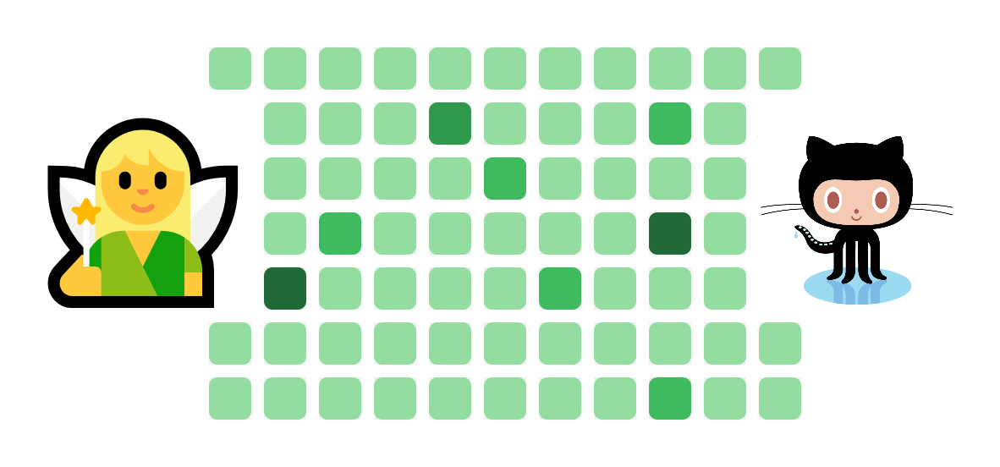

# Fairy of Grass

A little fairy that plants grass on your GitHub contribution graph every day, using GitHub Actions.

**English** · [한국어](ko.README.md)

## Raising your fairy

1. Click **Use this template** to create your own repository. ([Docs](https://docs.github.com/en/repositories/creating-and-managing-repositories/creating-a-repository-from-a-template#creating-a-repository-from-a-template))
2. In **Settings → Secrets and variables → Actions**, add a secret named `USER_EMAIL` with your GitHub account's email address. ([Docs](https://docs.github.com/en/actions/how-tos/write-workflows/choose-what-workflows-do/use-secrets#creating-secrets-for-a-repository))
3. Done! Take good care of it.

## How it works

Every day around 12:00 UTC, the fairy wakes up and plants grass on your GitHub profile. It's an empty commit, so not a single line of code changes. The grass is green anyway.

Want a different time? Change the `cron` line in [`.github/workflows/main.yml`](.github/workflows/main.yml).
